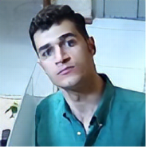

# Image Super Spectra Vision

The Image Super Spectra Vision marks a significant advancement in image enhancement, combining state-of-the-art
super-resolution techniques with user accessibility. Leveraging the power of ESRGAN and our proprietary MultipleSR
model, it delivers exceptional image clarity and detail. Ideal for diverse applications from professional photography to
medical imaging, this platform provides a comprehensive solution for uncovering intricate details in images, offering a
gateway to our extensive super-resolution capabilities.

## Table of Contents

- [Introduction](#introduction)
- [Features](#features)
- [Installation](#installation)
- [Usage](#usage)
- [Result Examples](#output-example)
- [Explore Our Kernel 🚀](#explore-our-kernel-)
- [Technology Stack](#technology-stack)
- [License](#license)
- [Contributions](#contributions)
- [Credits and Acknowledgements](#credits-and-acknowledgements)
- [Contact Information](#contact-information)

## Introduction

Welcome to the Image Super Spectra Vision, a state-of-the-art platform engineered to transform image resolution through
innovative super-resolution technologies. This system is not just a tool; it's a gateway to unlocking unseen details in
images ranging from everyday photography to specialized fields like medical imaging and geospatial analysis. Our
sophisticated approach, including the renowned ESRGAN model and our proprietary MultipleSR model, ensures unparalleled
image clarity and detail. Dive into the world of high-fidelity imaging with our comprehensive guide covering everything
from setup to execution.

## Features

### Advanced ESRGAN-based Super-Resolution

1. **High-Fidelity ESRGAN Model:** Our system employs the Enhanced Super-Resolution Generative Adversarial Network (
   ESRGAN), renowned for its ability to upscale images with exceptional quality.
2. **Quadruple Magnification Capability:** Experience a new level of detail with a magnification power of up to 4X,
   making every pixel count in the journey from blur to clarity.
3. **Broad Spectrum Application:** From professional photographers to scientific researchers, our ESRGAN implementation
   is versatile enough to cater to a vast array of image enhancement needs.

### Customizable MultipleSR Model

1. **Tailored Super-Resolution:** The MultipleSR model is our answer to diverse magnification requirements,
   custom-trained to handle various scales with precision.
2. **Dynamic Model Adaptation:** Seamlessly switch between different magnifications and models, thanks to our dynamic
   loading feature, catering to specific image requirements.
3. **Extendable Framework:** The MultipleSR model sets the stage for continuous innovation, allowing for the integration
   of future advancements in super-resolution technology.

## Installation

Embark on your journey to superior image resolution by following these simple installation steps:

1. **Environment Setup:**
    - Initiate your venture with Python 3.9 in a virtual environment, ensuring a clean and controlled setting.
    - Forge your path by creating a 'Models' directory at the root.

2. **Model Acquisition:**
    - Access our curated collection of
      models [here](https://drive.google.com/drive/folders/1xqpAl0RXVSifARC7flcH_TUfphMj1j1w?usp=sharing) using the
      passphrase: `Super_Spectra_Vision`.
    - Unearth the models and station them in your newly created 'Models' directory.

3. **Dependency Installation:**
    - Install the necessary dependencies to empower your system with the command:
      ```bash
      pip install -r requirements.txt
      ```

## Usage

Using Super Spectra Vision is straightforward. Follow these steps to generate high quality images:

1. **Open Terminal or Command Prompt:** Navigate to the directory where Lingua Luxe Vision is installed.

2. **Run the script using Python and provide the necessary arguments:** the model name, magnification factor, and the
   path to the image. For example:

   ```bash
   python super_resolution_app.py --model_name --magnification --image_path
   ```
    - `--model_name`: Place your chosen model.
    - `--magnification`: Place 4 your chosen magnification factor.
    - `--image_path`: Place path/to/your/image.jpg with the actual path to your image.

   For example, to generate an image using the detailed model with specific magnification, your command might look like
   this:

   ```bash
   python super_resolution_app.py EDSR 4 path/to/your/image.jpg
   ```

3. **Understanding the Script's Output:**

The script will validate the model and magnification factor based on the provided compatibility table:

<style>
  .custom-row {
    background-color: #c2c2c2;
    color: #000000;
    font-family: 'Times New Roman', Times, serif;
  }
</style>

<table align="center">
   <tr class="custom-row">
      <td colspan="1" align="center">
         <h4>Model</h4>
      </td>
      <td colspan="1" align="center">
         <h4>Available Size</h4>
      </td>
   </tr>
   <tr>
      <td colspan="1" align="center">EDSR</td>
      <td colspan="1" align="center">2, 3, 4</td>
   </tr>
   <tr>
      <td colspan="1" align="center">ESPCN</td>
      <td colspan="1" align="center">2, 3, 4</td>
   </tr>
   <tr>
      <td colspan="1" align="center">FSRCNN</td>
      <td colspan="1" align="center">2, 3, 4</td>
   </tr>
   <tr>
      <td colspan="1" align="center">LapSRN</td>
      <td colspan="1" align="center">2, 4, 8</td>
   </tr>
   <tr>
      <td colspan="1" align="center">ESRGAN</td>
      <td colspan="1" align="center">4</td>
   </tr>
</table>


---
If the combination is valid, it will proceed to enhance the resolution of the provided image using the ImageSR class.
The enhanced image will be displayed on your screen if the process is successful. If you enter an invalid model or
magnification factor (one that's not compatible according to your
table), the script will raise an error and terminate.

## Result Examples

Here are some examples for different methods and their outputs. Each image has a related caption that explains that
image.

<table>
   <tr>
      <td colspan="5" align="center">
         <h4 class="custom-row">Input Image - 68 by 68 </h4>
         <br />
      </td>
   </tr>

   <tr class="custom-row" class="custom-row">
      <td colspan="5" align="center">
         <h4>Magnifying by 2 with the size 128 by 128</h4>
      </td>
   </tr>
   <tr>
      <td align="center">EDSR<br/></td>
      <td align="center">ESCPN<br/></td>
      <td align="center">FSRCNN<br/></td>
      <td align="center">LapSRN<br/></td>
      <td align="center">ESRGAN<br/></td>   
   </tr>

   <tr class="custom-row">
      <td colspan="5" align="center">
         <h4>Magnifying by 3 with the size 128 by 128</h4>
      </td>
   </tr>
   <tr>
      <td align="center">EDSR<br/></td>
      <td align="center">ESCPN<br/></td>
      <td align="center">FSRCNN<br/></td>
      <td align="center">LapSRN<br/></td>
      <td align="center">ESRGAN<br/></td>   
</tr>

   <tr class="custom-row">
      <td colspan="5" align="center">
         <h4>Magnifying by 4 with the size 256 by 256</h4>
      </td>
   </tr>
   <tr>
      <td align="center">EDSR<br/></td>
      <td align="center">ESCPN<br/></td>
      <td align="center">FSRCNN<br/></td>
      <td align="center">LapSRN<br/></td>
      <td align="center">ESRGAN<br/></td>   
   </tr>

   <tr>
      <td colspan="5" align="center">
         <h4 class="custom-row">Magnifying by 4 with the size 256 by 256</h4>
         <br />
      </td>
   </tr>
</table>

<table>
   <tr class="custom-row">
      <td colspan="4" align="center">
         <h4>Image enlargement without exploiting any Super Resolution algorithm</h4>
      </td>
   </tr>
   <tr>
      <td align="center">X2<br/></td>
      <td align="center">X3<br/></td>
      <td align="center">X4<br/></td>
      <td align="center">X8<br/></td> 
   </tr>
</table>

# Explore Our Kernel 🚀

We are thrilled to unveil our cutting-edge kernel, an embodiment of innovation that integrates the audio manipulation
capabilities of Super Spectra Vision! It's not just a repository; it's a revolution in audio processing, built with our
audio projects at its heart.

## Catch the Wave of Audio Innovation

Don't miss out on this opportunity to be a part of the audio evolution. Click the link blow, star the repo for future
updates, and let your ears be the judge. If you're as passionate about audio as we are, we look forward to seeing you
there!

Remember, the future of audio is not just heard; it's shared and shaped by enthusiasts and professionals alike. Let's
make waves together with Super Spectra Vision and our Kernel. 🚀

🔗 [Kernel Repository](https://github.com/Meta-Intelligence-Services)

---

For any queries or discussions regarding our kernel, feel free to open an issue in the kernel's repository, and we'll be
more than happy to engage with you. Together, we're not just changing audio; we're making history!

## Technology Stack

Super Spectra Vision is powered by a carefully curated selection of technologies, each contributing its unique strengths
to our advanced image processing and analysis capabilities:

- **numpy (1.26.3)**: As the fundamental package for scientific computing in Python, NumPy offers powerful numerical
  array objects and a wide range of mathematical functions to efficiently handle large, multi-dimensional arrays and
  matrices, which are central to image processing tasks.

- **pillow (10.2.0)**: A modern, Python Imaging Library (PIL) fork, Pillow provides extensive support for opening,
  manipulating, and saving many different image file formats. It's pivotal for image transformations and operations
  within our application.

- **matplotlib (3.8.2)**: An essential library for creating static, interactive, and animated visualizations in Python.
  Matplotlib is used in Super Spectra Vision for plotting graphs and visual data representations, crucial for analysis
  and debugging.

- **singleton-decorator**: This Python package is utilized to implement the singleton design pattern, ensuring that a
  class has only one instance and providing a global point of access to that instance. This is particularly useful for
  managing shared resources and configurations.

- **tensorflow-gpu (2.9.0)**: TensorFlow with GPU support enables our system to leverage the power of graphics
  processing units (GPUs) for deep learning tasks. This accelerates the training and execution of neural networks,
  making our image processing tasks faster and more efficient.

- **tensorflow_hub (0.15.0)**: TensorFlow Hub is a library for the publication, discovery, and consumption of reusable
  parts of machine learning models. In our application, it facilitates the easy integration and deployment of
  pre-trained TensorFlow models, enhancing our model's capabilities.

- **opencv-python (4.9.0.80)** and **opencv-contrib-python (4.9.0.80)**: OpenCV (Open Source Computer Vision Library) is
  an open-source computer vision and machine learning software library. These packages are essential for real-time image
  processing and computer vision tasks, providing a wide array of functionalities from basic image processing to complex
  algorithms.

## License

Super Spectra Vision is open-sourced under the MIT License. See [LICENSE](LICENSE) for more details.

## Contributions

While we deeply value community input and interest in Super Spectra Vision, the project is currently in a phase where
we're mapping out our next steps and are not accepting contributions just yet. We are incredibly grateful for your
support and understanding. Please stay tuned for future updates when we'll be ready to welcome contributions with open
arms.

## Credits and Acknowledgements

We would like to extend our heartfelt thanks to Mr.Poorya Omeedi for his guidance and wisdom throughout the
development of Super Spectra Vision. His insights have been a beacon of inspiration for this project.

## Contact Information

Although we're not open to contributions at the moment, your feedback and support are always welcome. Please feel free
to star the project or share your thoughts through the Issues tab on GitHub, and we promise to consider them
carefully.please [open an issue](https://github.com/Amir-Nassimi/Super-Spectra-Vision/issues) in the Super Spectra
Vision repository, and we will assist you.