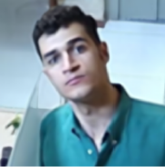

# Image Super Spectra Vision

The Image Super Spectra Vision represents a leap in image enhancement technology, merging the realms of advanced
super-resolution algorithms with practical, user-friendly applications. At its core, this platform utilizes
groundbreaking techniques such as the ESRGAN model and our unique MultipleSR model to redefine image clarity and detail.
Designed for a wide range of applications, from professional photography to intricate fields like medical imaging and
satellite analysis, the Image Super Spectra Vision offers an unparalleled toolset for revealing hidden details in
images. This summary is your gateway to exploring our full suite of super-resolution capabilities.

## Table of Contents

- [Introduction](#introduction)
- [Features](#features)
- [Installation](#installation)
- [Usage](#usage)
- [Result Examples](#output-example)
- [Explore Our Kernel 🚀](#explore-our-kernel-)
- [Technology Stack](#technology-stack)
- [License](#license)
- [Contributions](#contributions)
- [Credits and Acknowledgements](#credits-and-acknowledgements)
- [Contact Information](#contact-information)

## Introduction

Welcome to the Image Super Spectra Vision, a state-of-the-art platform engineered to transform image resolution through
innovative super-resolution technologies. This system is not just a tool; it's a gateway to unlocking unseen details in
images ranging from everyday photography to specialized fields like medical imaging and geospatial analysis. Our
sophisticated approach, including the renowned ESRGAN model and our proprietary MultipleSR model, ensures unparalleled
image clarity and detail. Dive into the world of high-fidelity imaging with our comprehensive guide covering everything
from setup to execution.

## Features

### Advanced ESRGAN-based Super-Resolution

1. **High-Fidelity ESRGAN Model:** Our system employs the Enhanced Super-Resolution Generative Adversarial Network (
   ESRGAN), renowned for its ability to upscale images with exceptional quality.
2. **Quadruple Magnification Capability:** Experience a new level of detail with a magnification power of up to 4X,
   making every pixel count in the journey from blur to clarity.
3. **Broad Spectrum Application:** From professional photographers to scientific researchers, our ESRGAN implementation
   is versatile enough to cater to a vast array of image enhancement needs.

### Customizable MultipleSR Model

1. **Tailored Super-Resolution:** The MultipleSR model is our answer to diverse magnification requirements,
   custom-trained to handle various scales with precision.
2. **Dynamic Model Adaptation:** Seamlessly switch between different magnifications and models, thanks to our dynamic
   loading feature, catering to specific image requirements.
3. **Extendable Framework:** The MultipleSR model sets the stage for continuous innovation, allowing for the integration
   of future advancements in super-resolution technology.

## Installation

Embark on your journey to superior image resolution by following these simple installation steps:

1. **Environment Setup:**
    - Initiate your venture with Python 3.9 in a virtual environment, ensuring a clean and controlled setting.
    - Forge your path by creating a 'Models' directory at the root.

2. **Model Acquisition:**
    - Access our curated collection of
      models [here](https://drive.google.com/drive/folders/1xqpAl0RXVSifARC7flcH_TUfphMj1j1w?usp=sharing) using the
      passphrase: `Super_Spectra_Vision`.
    - Unearth the models and station them in your newly created 'Models' directory.

3. **Dependency Installation:**
    - Install the necessary dependencies to empower your system with the command:
      ```bash
      pip install -r requirements.txt
      ```

## Usage

Elevate your images to new heights with a simple command:

```bash
python super_resolution_app.py [model; e.g. EDSR] [available size; e.g. 4] [path/to/your/image.jpg]
```

Choose from an array of models to best suit your image enhancement needs:

| Model  | Available Sizes |
|--------|-----------------|
| EDSR   | 2, 3, 4         |
| ESPCN  | 2, 3, 4         |
| FSRCNN | 2, 3, 4         |
| LapSRN | 2, 4, 8         |
| ESRGAN | 4               |

## Result Examples

Here are some examples for different methods and their outputs. Each image has a related caption that explains that
image.

<style>
  .custom-row {
    background-color: #c2c2c2;
    color: #000000;
    font-family: 'Times New Roman', Times, serif;
  }
</style>

<table>
   <tr>
      <td colspan="5" align="center">
         <h4 class="custom-row">Input Image - 68 by 68 </h4>
         <br />
      </td>
   </tr>

   <tr class="custom-row" class="custom-row">
      <td colspan="5" align="center">
         <h4>Magnifying by 2 with the size 128 by 128</h4>
      </td>
   </tr>
   <tr>
      <td align="center">EDSR<br/></td>
      <td align="center">ESCPN<br/></td>
      <td align="center">FSRCNN<br/></td>
      <td align="center">LapSRN<br/></td>
      <td align="center">ESRGAN<br/></td>   
   </tr>

   <tr class="custom-row">
      <td colspan="5" align="center">
         <h4>Magnifying by 3 with the size 128 by 128</h4>
      </td>
   </tr>
   <tr>
      <td align="center">EDSR<br/></td>
      <td align="center">ESCPN<br/></td>
      <td align="center">FSRCNN<br/></td>
      <td align="center">LapSRN<br/></td>
      <td align="center">ESRGAN<br/></td>   
</tr>

   <tr class="custom-row">
      <td colspan="5" align="center">
         <h4>Magnifying by 4 with the size 256 by 256</h4>
      </td>
   </tr>
   <tr>
      <td align="center">EDSR<br/></td>
      <td align="center">ESCPN<br/></td>
      <td align="center">FSRCNN<br/></td>
      <td align="center">LapSRN<br/></td>
      <td align="center">ESRGAN<br/></td>   
   </tr>

   <tr>
      <td colspan="5" align="center">
         <h4 class="custom-row">Magnifying by 4 with the size 256 by 256</h4>
         <br />
      </td>
   </tr>
</table>

<table>
   <tr class="custom-row">
      <td colspan="4" align="center">
         <h4>Image enlargement without exploiting any Super Resolution algorithm</h4>
      </td>
   </tr>
   <tr>
      <td align="center">X2<br/></td>
      <td align="center">X3<br/></td>
      <td align="center">X4<br/></td>
      <td align="center">X8<br/></td> 
   </tr>
</table>

# Explore Our Kernel 🚀

We are thrilled to unveil our cutting-edge kernel, an embodiment of innovation that integrates the audio manipulation
capabilities of Super Spectra Vision! It's not just a repository; it's a revolution in audio processing, built with our
audio projects at its heart.

## Catch the Wave of Audio Innovation

Don't miss out on this opportunity to be a part of the audio evolution. Click the link blow, star the repo for future
updates, and let your ears be the judge. If you're as passionate about audio as we are, we look forward to seeing you
there!

Remember, the future of audio is not just heard; it's shared and shaped by enthusiasts and professionals alike. Let's
make waves together with Super Spectra Vision and our Kernel. 🚀

🔗 [Kernel Repository](https://github.com/Meta-Intelligence-Services)

---

For any queries or discussions regarding our kernel, feel free to open an issue in the kernel's repository, and we'll be
more than happy to engage with you. Together, we're not just changing audio; we're making history!

## Technology Stack

Super Spectra Vision is built with the following robust technologies:

- numpy==1.26.3
- pillow==10.2.0
- matplotlib==3.8.2
- singleton-decorator
- tensorflow-gpu==2.9.0
- tensorflow_hub==0.15.0
- opencv-python==4.9.0.80
- opencv-contrib-python==4.9.0.80

## License

Super Spectra Vision is open-sourced under the MIT License. See [LICENSE](LICENSE) for more details.

## Contributions

While we deeply value community input and interest in Super Spectra Vision, the project is currently in a phase where
we're mapping out our next steps and are not accepting contributions just yet. We are incredibly grateful for your
support and understanding. Please stay tuned for future updates when we'll be ready to welcome contributions with open
arms.

## Credits and Acknowledgements

We would like to extend our heartfelt thanks to Mr.Poorya Omeedi for his guidance and wisdom throughout the
development of Super Spectra Vision. His insights have been a beacon of inspiration for this project.

## Contact Information

Although we're not open to contributions at the moment, your feedback and support are always welcome. Please feel free
to star the project or share your thoughts through the Issues tab on GitHub, and we promise to consider them
carefully.please [open an issue](https://github.com/Amir-Nassimi/Super-Spectra-Vision/issues) in the Super Spectra
Vision repository, and we will assist you.